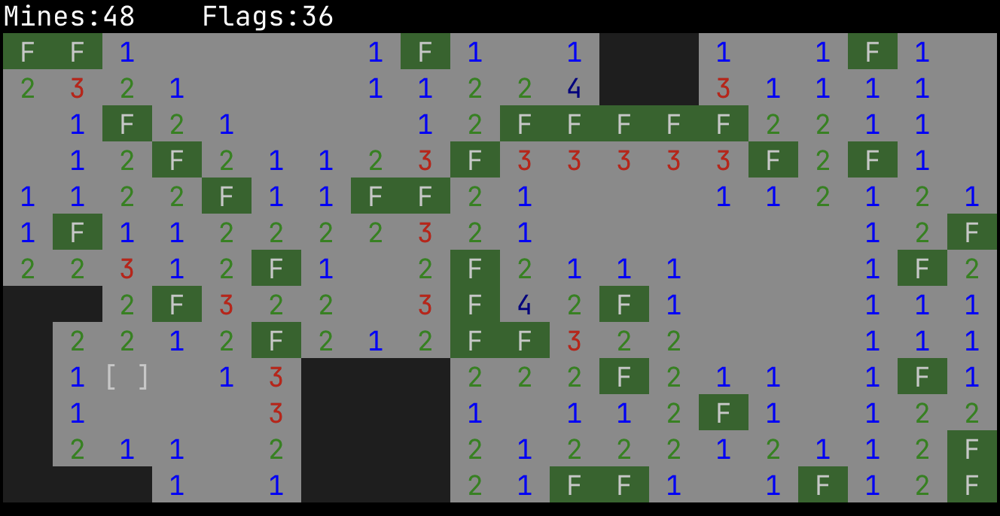
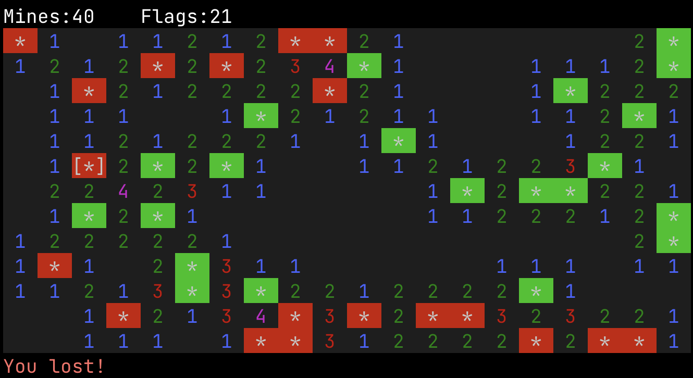

# Mnswpr

Terminal minesweeper

```
A simple minesweeper game for the terminal.

Move the cursor with either wasd, hjkl or the arrows.
Flag/unflag the cell under the cursor by pressing f, or uncover it by pressing <space> or <insert>.

Usage: mnswpr [OPTIONS]

Options:
  -c, --columns <COLS>
          The number of columns of the field. Must be greater than 1

  -r, --rows <ROWS>
          The number of rows of the field. Must be greater than 1

  -m, --mine-percentage <MINE_PERCENTAGE>
          The percentage of mines in the field. Must be in the range (1, 100)
          [default: 20]

  -p, --preset <PRESET>
          The size preset of the field. Note that `-c` and `-r` take precendence over the preset
          [default: tiny]

  -t, --theme <THEME>
          The theme of the board
          [default: mnswpr]

      --assisted-flagging
          If active, trying to flag an open cell with N neighboring mines and N non-open adjacent cells will result in all of those cells getting flagged

      --assisted-opening
          If active, trying to open an open cell with N neighboring mines and N flagged adjacent cells will result in all of those cells getting opened

  -h, --help
          Print help information (use `-h` for a summary)

  -V, --version
          Print version information
```

If you don't want to specify the dimensions, you can use the `-p` or `--preset` flags and provide one of the provided presets:
- `tiny`: 20x13 field
- `small`: 30x20 field
- `medium`: 40x25 field
- `large`: 50x30 field
- `huge`: 60x40 field

**Note**: controls are case-insensitive

**Note** that the sizes the field will always be constrained by the size of the terminal. As such, width and height will be clamped between 1 and you terminal's width/height minus some padding

## Screenshots



