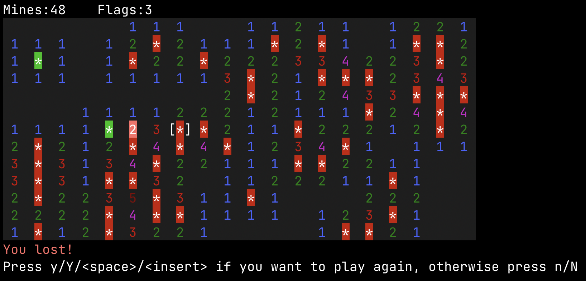

# Minesweeper

Terminal minesweeper

## Controls

You can move the cursor (`[...]`) by using arrows, `wasd` or `hjkl`. 

Uncover the cell under the cursor by pressing `<space>` or `<insert>`, or flag (or un-flag it) by pressing `f`.

Press `q` at any moment to quit.

**Note**: controls are case-insensitive

## CLI options

The field can be customized via CLI flags:
- `-c` or `--columns` controls the numer of columns of the field
- `-r` or `--rows` controls the number of rows of the field
- `-m` or `--mine-percentage` controls the % of mines in the field
  
If you don't want to specify the dimensions, you can use the `-p` or `--preset` flags and provide one of the provided presets:
- `tiny`: 20x13 field
- `small`: 30x20 field
- `medium`: 40x25 field
- `large`: 50x30 field
- `huge`: 60x40 field

**Note** that the sizes the field will always be constrained by the size of the terminal. As such, width and height will be clamped between 1 and you terminal's width/height minus some padding

## Screenshots

